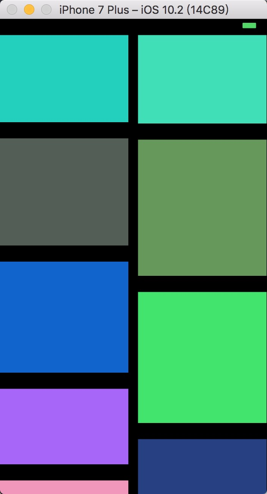
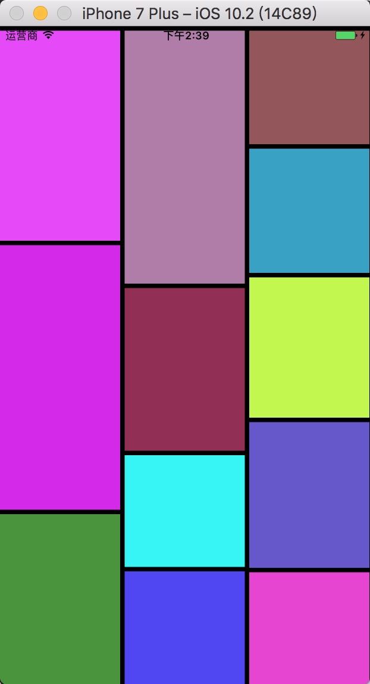
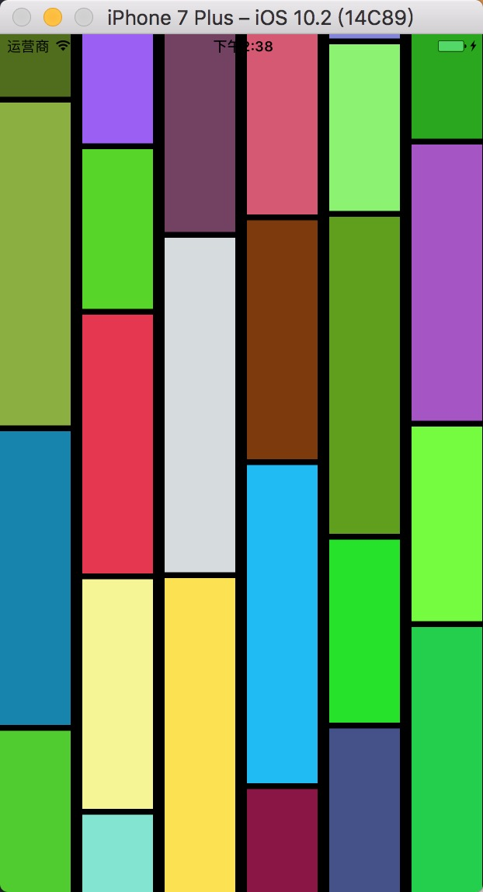

# LCollectionViewLayout

本项目实现常见的瀑布流效果。

# 列数为2 

# 列数为3

# 列数为6

本项目使用方便: 
1.只需要初始化一个LCollectionLayout  
2.初始化LCollectionLayout时，将每个item的高度传入，具体可看demo  
3.将LCollectionLayout作为你想要布局的collectionView的collectionViewLayout即可  
/Users/Soulmate/Desktop/Demo/QQDrawer_swift/QQDRAWER.gif
